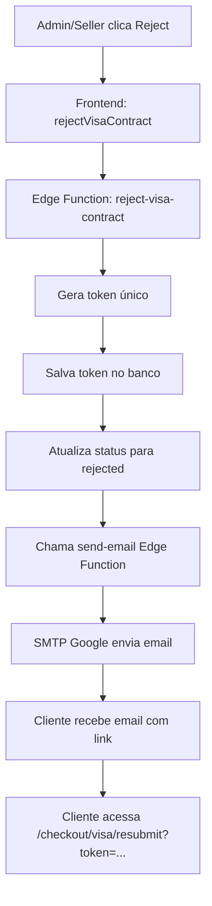

# 📧 Sistema de Envio de Email de Rejeição de Contrato

## 🔄 Fluxo Completo



## 📁 Arquivos Envolvidos

### 1. **Edge Function: `reject-visa-contract`**
**Localização:** `supabase/functions/reject-visa-contract/index.ts`

**O que faz:**
1. Recebe `order_id`, `rejection_reason` (opcional), `reviewed_by`
2. Busca dados do pedido (email, nome, order_number)
3. Gera token único: `visa_reject_{timestamp}_{random1}_{random2}`
4. Salva token na tabela `visa_contract_resubmission_tokens` com expiração de 30 dias
5. Atualiza `visa_orders.contract_approval_status = 'rejected'`
6. **Chama a Edge Function `send-email`** passando o HTML completo do email
7. Retorna sucesso

**Código relevante (linhas 116-226):**
```typescript
// Send rejection email via send-email function
const { error: emailError } = await supabase.functions.invoke('send-email', {
  body: {
    to: order.client_email,
    subject: 'Action Required: Resubmit Your Visa Service Documents',
    html: `<!DOCTYPE html>...` // Template HTML completo inline
  },
});
```

### 2. **Edge Function: `send-email`**
**Localização:** `supabase/functions/send-email/index.ts`

**O que faz:**
1. Recebe `to`, `subject`, `html` (e opcionalmente `from`)
2. Lê credenciais SMTP das variáveis de ambiente do Supabase:
   - `SMTP_HOST` (padrão: smtp.gmail.com)
   - `SMTP_PORT` (padrão: 587)
   - `SMTP_USER` (email do Gmail)
   - `SMTP_PASS` (senha de app do Google)
   - `SMTP_FROM_EMAIL` (email remetente)
   - `SMTP_FROM_NAME` (nome remetente, padrão: "MIGMA")
3. Conecta ao servidor SMTP do Google
4. Autentica usando STARTTLS (porta 587) ou TLS direto (porta 465)
5. Envia o email via protocolo SMTP
6. Retorna sucesso ou erro

**Configuração necessária no Supabase:**
- Vá em: **Settings > Edge Functions > Secrets**
- Adicione:
  - `SMTP_HOST`: smtp.gmail.com
  - `SMTP_PORT`: 587
  - `SMTP_USER`: seu-email@gmail.com
  - `SMTP_PASS`: senha-de-app-do-google (não a senha normal!)
  - `SMTP_FROM_EMAIL`: seu-email@gmail.com
  - `SMTP_FROM_NAME`: MIGMA

### 3. **Template HTML do Email**

O template HTML está **inline** na Edge Function `reject-visa-contract` (linhas 121-224).

**Estrutura do template:**
- **Header:** Logo MIGMA
- **Título:** "Action Required: Resubmit Documents" (com gradiente dourado)
- **Saudação:** "Dear {nome do cliente}"
- **Mensagem:** Explica que o contrato foi revisado e precisa reenviar documentos
- **Motivo da rejeição:** Se fornecido, mostra em uma caixa destacada
- **Lista de passos:** 4 itens explicando o que fazer
- **Botão CTA:** Link para resubmit com estilo dourado
- **Link alternativo:** URL completa para copiar/colar
- **Aviso:** Link expira em 30 dias
- **Footer:** Copyright e nota legal

**Variáveis dinâmicas no template:**
- `${order.client_name}` - Nome do cliente
- `${order.order_number}` - Número do pedido
- `${rejection_reason}` - Motivo da rejeição (se fornecido)
- `${resubmitUrl}` - URL completa: `{baseUrl}/checkout/visa/resubmit?token={token}`

### 4. **Função Helper no Frontend**

**Localização:** `src/lib/visa-contracts.ts`

**Função:** `rejectVisaContract()`

```typescript
export async function rejectVisaContract(
  orderId: string,
  reviewedBy: string,
  reason?: string
): Promise<{ success: boolean; token?: string; error?: string }> {
  // Chama a Edge Function reject-visa-contract
  const { data, error } = await supabase.functions.invoke('reject-visa-contract', {
    body: {
      order_id: orderId,
      reviewed_by: reviewedBy,
      rejection_reason: reason || null,
    },
  });
  // Retorna resultado
}
```

## 📋 Passo a Passo do Envio

1. **Admin/Seller rejeita contrato:**
   - Clica em "Reject Contract" na página de detalhes
   - Opcionalmente preenche motivo da rejeição
   - Confirma a ação

2. **Frontend chama helper:**
   - `rejectVisaContract(orderId, userId, reason)`
   - Esta função chama a Edge Function

3. **Edge Function `reject-visa-contract`:**
   - Valida parâmetros
   - Busca dados do pedido
   - Gera token único
   - Salva token no banco
   - Atualiza status do pedido
   - **Monta HTML do email** (template inline)
   - **Invoca `send-email`** passando HTML

4. **Edge Function `send-email`:**
   - Recebe HTML completo
   - Conecta ao SMTP do Google
   - Autentica
   - Envia email
   - Retorna sucesso/erro

5. **Cliente recebe email:**
   - Email chega na caixa de entrada
   - Contém link: `/checkout/visa/resubmit?token={token}`
   - Cliente clica no link

6. **Página de reenvio:**
   - Valida token
   - Mostra formulário para reenviar documentos
   - Cliente faz upload novamente

## 🎨 Template HTML - Estrutura Visual

```
┌─────────────────────────────────────┐
│         [LOGO MIGMA]                │
├─────────────────────────────────────┤
│  Action Required: Resubmit          │
│         Documents                   │
├─────────────────────────────────────┤
│  Dear {Nome},                       │
│                                     │
│  We have reviewed your contract...  │
│                                     │
│  [Motivo da Rejeição - se houver]  │
│                                     │
│  Please click below to:             │
│  1. Upload front of ID              │
│  2. Upload back of ID               │
│  3. Upload selfie                   │
│  4. Accept terms                    │
│                                     │
│  [Botão: Resubmit Documents]       │
│                                     │
│  Link alternativo:                  │
│  https://.../resubmit?token=...    │
│                                     │
│  ⚠️ Link expira em 30 dias         │
│                                     │
│  Best regards,                      │
│  The MIGMA Team                     │
├─────────────────────────────────────┤
│  © 2025 MIGMA. All rights reserved. │
└─────────────────────────────────────┘
```

## 🔧 Configuração SMTP

### Variáveis de Ambiente no Supabase

**Onde configurar:**
- Supabase Dashboard > Settings > Edge Functions > Secrets

**Variáveis necessárias:**
```
SMTP_HOST=smtp.gmail.com
SMTP_PORT=587
SMTP_USER=seu-email@gmail.com
SMTP_PASS=senha-de-app-google
SMTP_FROM_EMAIL=seu-email@gmail.com
SMTP_FROM_NAME=MIGMA
```

**Como obter senha de app do Google:**
1. Acesse: https://myaccount.google.com/apppasswords
2. Gere uma senha de app
3. Use essa senha (não a senha normal do Gmail)

## 📝 Exemplo de Email Enviado

**Assunto:** `Action Required: Resubmit Your Visa Service Documents`

**Conteúdo:**
- Logo MIGMA no topo
- Título em gradiente dourado
- Mensagem personalizada com nome do cliente
- Motivo da rejeição (se fornecido)
- Lista numerada de passos
- Botão grande dourado "Resubmit Documents"
- Link completo para copiar
- Aviso de expiração em 30 dias
- Footer com copyright

## 🔍 Debug e Logs

**Logs na Edge Function `reject-visa-contract`:**
- `[EDGE FUNCTION] Rejecting visa contract for order: {order_id}`
- `[EDGE FUNCTION] Contract rejected successfully, token created and email sent`

**Logs na Edge Function `send-email`:**
- `[EDGE FUNCTION] Sending email to: {email}`
- `[EDGE FUNCTION] Sending email via SMTP: {...}`
- `[EDGE FUNCTION] Email sent successfully via SMTP`

**Se houver erro:**
- Verifique logs no Supabase Dashboard > Edge Functions > Logs
- Verifique se as credenciais SMTP estão corretas
- Verifique se a senha de app do Google está configurada

## ✅ Checklist de Funcionamento

- [ ] Edge Function `reject-visa-contract` deployada
- [ ] Edge Function `send-email` deployada
- [ ] Variáveis SMTP configuradas no Supabase Secrets
- [ ] Senha de app do Google gerada e configurada
- [ ] Teste de envio realizado
- [ ] Email chegando na caixa de entrada (não spam)
- [ ] Link no email funcionando corretamente


